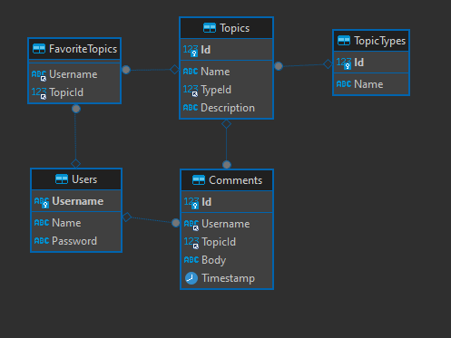

# Rendszerfejlesztés csapatmunka - BoberBlog

## How to Run Using Docker

1. Clone the repository
2. Copy [`.env.dist`](.env.dist) to `.env` and fill in the environmental variables. The file contains an example.
3. Install [Docker](https://www.docker.com/) and [Docker Compose](https://docs.docker.com/compose/)
4. Run `docker compose up -d --build` in the root directory
5. Open `http://localhost:8023` in your browser

You can connect to the database using any MySQL compatible database client, for example [DBeaver](https://dbeaver.io/)

### API Endpoint List

The API endpoints are defined in [`server.py`](server.py). Here's a concise breakdown of each endpoint:

- `/`: Home Page
- `/logout`: Log out the current user
- `/blog`: Blog Page
- `/get_topics`: Retrieve all topics
- `/get_topic_types`: Retrieve all topic types
- `/get_comments`: Retrieve all comments for a topic
- `/add_comment`: Add a comment to a topic
- `/add_favorite`: Add a topic to the user's favorites
- `/remove_favorite`: Remove a topic from the user's favorites
- `/get_topics_commented`: Retrieve all topics commented by the current user

### Used Technologies

#### Backend
- **Python**: The programming language used for backend development. [Python](https://www.python.org/)
- **Flask**: A lightweight WSGI web application framework in Python. [Flask](https://flask.palletsprojects.com/)
- **Redis**: An open-source, in-memory data structure store, used for WebSocket synchronization and caching between threads. [Redis](https://redis.io/)
- **Gunicorn**: A Python WSGI HTTP Server for UNIX, used for running the Flask application. [Gunicorn](https://gunicorn.org/)
- **Docker**: A platform for building, shipping, and running applications in containers. [Docker](https://www.docker.com/)
- **MariaDB**: A community-developed fork of MySQL, used as the relational database management system. [MariaDB](https://mariadb.org/)

#### Frontend
- **Bootstrap**: A front-end framework used for designing and styling responsive web applications. [Bootstrap](https://getbootstrap.com/)
- **jQuery**: A fast, small, and feature-rich JavaScript library, simplifying tasks like HTML document traversal and manipulation, event handling, and animation. [jQuery](https://jquery.com/)

## Database Scheme

## How to Clear the DB's Data

You can clear the data generated by the MariaDB container by running `rm -rf /var/lib/rendszer-fejlesztes/`
